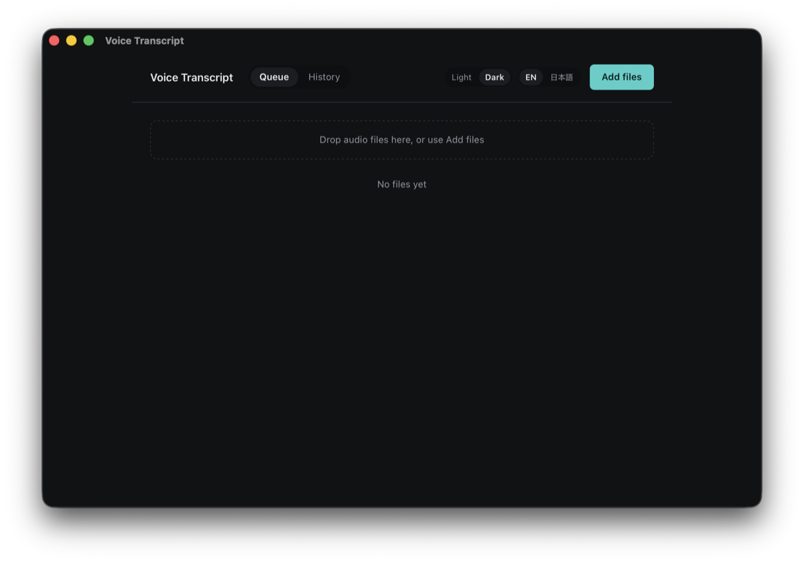
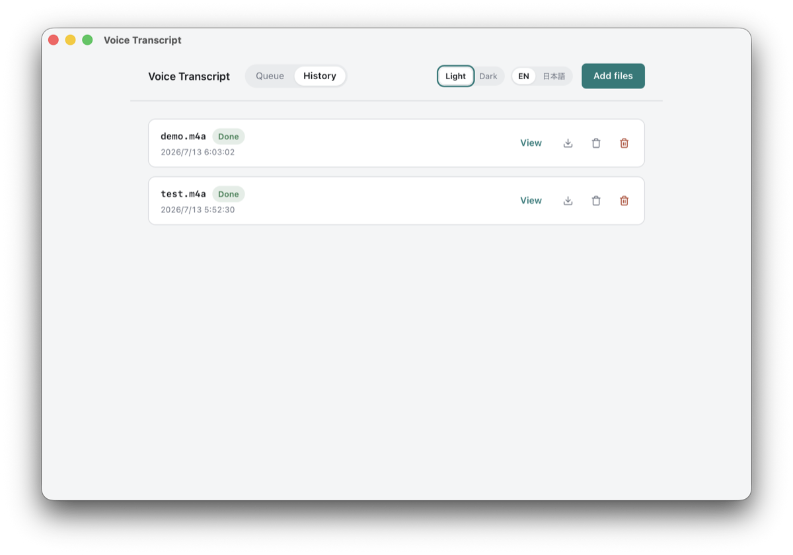
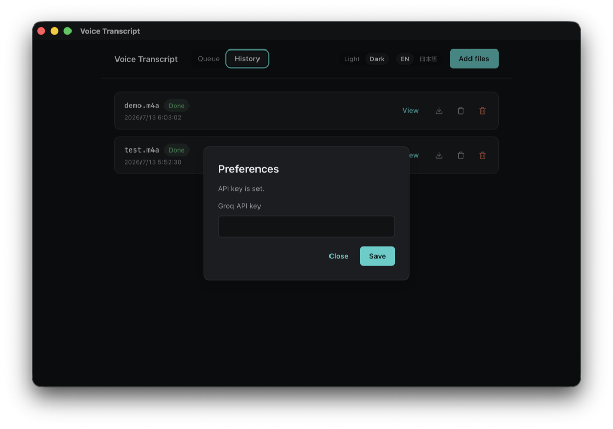
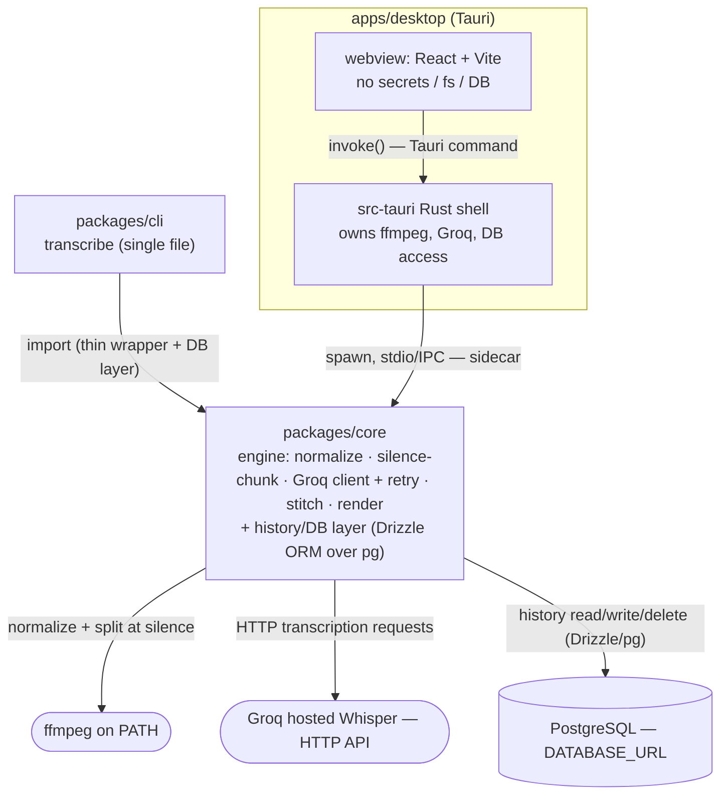

<div align="right">

[](./README.en.md)

</div>

# Voice Transcript

Groq のホスト型 Whisper API で音声を文字起こしする。ターミナル CLI とクロスプラットフォームの
デスクトップアプリの 2 つの入口から使え、無音位置での分割とスティッチで **1 時間超の長時間
音声**も確実に扱える。エンジンは共有の 1 つ、フロントは 2 つ、そして全実行の履歴を保存する。

## 必要環境
- **Node.js 24**
- **pnpm**（本リポジトリは workspace モノレポ: `packages/core` / `packages/cli` / `apps/desktop`）
- **ffmpeg**（`PATH` 上に必要。音声の正規化・分割に使用）
- **`GROQ_API_KEY`** — 環境変数から読み込む。デスクトップアプリでは Preferences から設定
  することもできる（後述）。両方ある場合は常に環境変数が優先される。
- **PostgreSQL** — 環境変数の `DATABASE_URL` 接続文字列で到達可能なもの。文字起こし
  **履歴**機能でのみ必要。文字起こし自体は DB 無しでも動く（「制約」参照）。DB サーバーは
  自分で用意し、アプリは接続するだけ。
- デスクトップアプリのビルド／実行には別途 Tauri ツールチェーン（Rust）が必要。特権操作
  （ffmpeg・Groq 呼び出し・DB アクセス）はすべて Rust シェルが担う。

## セットアップ
```sh
pnpm install                       # workspace 全パッケージを導入
```

## CLI の使い方
`transcribe` コマンドは単一ファイル専用で、デスクトップ追加後も挙動は不変。workspace の
ソースから実行する（公開・同梱はしない）:

```sh
transcribe <audio-file> [options]
```

| オプション | 説明 | 既定 |
|---|---|---|
| `-o, --output <file>` | 文字起こしをファイルに出力 | 標準出力 |
| `--format <txt\|srt\|vtt\|json>` | 出力形式 | `txt` |
| `--model <name>` | Whisper モデル（`whisper-large-v3-turbo` / `whisper-large-v3`） | `whisper-large-v3-turbo` |
| `--language <code>` | 話し言語を固定 | 自動判定 |

```sh
export GROQ_API_KEY=...                                # 必須
transcribe meeting.m4a                                 # txt を標準出力へ
transcribe meeting.m4a --format srt -o out.srt
transcribe long.m4a --model whisper-large-v3 --language ja
```

成功時は終了コード `0`。エラー時は非ゼロで stderr にメッセージ（キー未設定・ファイル不在／
不正・ffmpeg 未導入・API 失敗）。`-o` 指定時は文字起こしをファイルに書き、stderr にはログのみ
——標準出力はクリーンなまま。

## デスクトップアプリ（Windows / Linux / macOS）
```sh
pnpm --filter desktop tauri dev                        # 開発ループ
```

- **ファイルキュー:** 複数ファイルを一度に文字起こしできる（CLI は単一ファイルのままで、
  これは GUI 固有の差分）。各ファイルは独立に追跡され、1 件の失敗が他を止めない。
- **進捗:** ファイル単位、長時間ファイルの分割時はチャンク単位でも表示——不定スピナーは使わない。
- **履歴:** 全実行（CLI・GUI とも）を保存。履歴ビューで過去の実行を一覧し、開くと API を
  再呼び出しせずに保存済み文字起こしを表示する。
- **CLI と同じ設定**（形式・モデル・言語）をフラグではなくコントロールとして提供。
- **表示言語:** 日本語と英語をアプリ内で切り替え可能（再起動不要）。これは音声の話し言語で
  ある `--language` とは別物。
- **テーマ:** ライト／ダークの明示トグル（OS 追従だけではない）。
- **履歴項目の削除——2 つの別アクション:** *ソース音声をゴミ箱へ* はソースファイルのみを OS
  のゴミ箱へ移し（復元可能）、履歴レコードと文字起こしは保持する。*履歴エントリを削除* は
  レコード自体を削除し、ソースファイルが残っていればそれも OS ゴミ箱へ送る。いずれも
  完全な復元不能削除ではない。
- **ネイティブ OS メニュー:** webview 内コントロールだけでなく本物の OS メニューを提供し、
  **Add files** / **Open history** / **Export**（現在の文字起こしを既存形式 txt/srt/vtt/json
  で書き出し）/ **View on GitHub** / **Preferences...** を公開。Preferences はプラット
  フォーム標準ショートカット（macOS: Cmd+, / Windows・Linux: Ctrl+,）に割り当て。

<p>
  
  
</p>
<p>
  
</p>

### Preferences（API キー）
Preferences ビューで、環境変数ではなく GUI から `GROQ_API_KEY` を設定できる。キーは Rust
シェルが OS のユーザーごとの設定ディレクトリ内の**ローカル設定ファイル**（macOS:
`~/Library/Application Support/…`、Windows: `%APPDATA%\…`、Linux: `~/.config/…`）に書き込み、
リポジトリ外に置きコミットしない。webview はこのファイルに直接触れない。サイドカーはこの
キーを、環境変数 `GROQ_API_KEY` が未設定のときにのみ使う。

トレードオフ（明言）: これは暗号化された OS キーチェーンではなく、平文のオンディスク保存で
ある。守りは所有者のみのファイル権限とリポジトリ外配置だけ。単一ユーザーの個人ツールとして
許容範囲だが、複数ユーザーや共有マシンでの利用前には見直し（例: OS キーチェーンへの移行）
が必要。

## 出力と長時間音声の挙動
- 形式: `txt`（既定・タイムスタンプ無し）／`srt`／`vtt`／`json`（区間・語のタイムスタンプ）。
- 長時間音声: ffmpeg で 16 kHz モノラルに正規化 → エンコード後が閾値（約 24 MB、Groq の
  25 MB/リクエスト上限の下）を超える場合は**無音位置で分割** → 各チャンクを文字起こし →
  各チャンクの時間オフセットを適用して**スティッチ**（マージ後のタイムスタンプは単調
  非減少）。約 78 分の `tests/test.m4a`（73 MB）で検証。
- 同じファイルを同じ設定で CLI と GUI で処理するとバイト単位で同一のテキストになる——
  どちらも同じ `packages/core` エンジンを呼ぶため。

## 文字起こし履歴（Postgres）
完了した全実行（CLI・GUI とも）が 1 レコードを書き込む: ソースファイル名、開始時刻、モデル、
言語、要求形式、ステータス、文字起こしテキスト（形式に応じて区間も）。`DATABASE_URL` は
環境変数からのみ読み、DB 関連はハードコードしない。データアクセス層は ORM／クエリビルダー
経由（マイグレーション以外にベンダー固有の生 SQL を置かない）とし、将来の MySQL や別ホストへの
移行を書き換えではなく設定変更で済むようにする。アプリは Postgres に接続するだけで、構築・
移行・バックアップはしない。

## リリース自動化
手動トリガーの GitHub Actions ワークフロー（`.github/workflows/release.yml`、
`workflow_dispatch` のみ——push/tag では発火しない）。入力は **title** と **version/tag** の
2 つだけ。`windows-latest` / `ubuntu-latest` / `macos-latest` で **`apps/desktop` のみ**を
ビルドし、各プラットフォームのネイティブインストーラ（macOS `.dmg`、Windows `.exe`、Linux
`.AppImage`/`.deb`）を GitHub Release にアップロードする。`packages/cli` はリリースでは
ビルド・公開されず、ソースから使う。

## 制約
- **Groq 無料枠のみ:** 25 MB/リクエスト、7,200 音声秒/時、2,000 リクエスト/日。分割戦略は
  25 MB 上限を守るために存在する。
- ソース・CLI 出力・GUI コピーに**絵文字禁止**。GUI の**色は必ず design token 経由**
  （hex ハードコード禁止、design gate で強制）。
- 履歴には到達可能な Postgres が必要だが、DB が未設定／到達不能でも文字起こしは完了する
  こと——失敗するのは履歴書き込みのみで、それは明示的にログされ（黙って失敗しない）、
  文字起こし自体を止めたり壊したりしない。
- git はローカルのみ。指示がない限り push しない。生成物の言語は英語。

## 対象外（明示）
話者分離、翻訳、要約／LLM による後処理、CLI の一括・ディレクトリ・複数ファイル処理（GUI の
キューは GUI 限定）、リアルタイム／ストリーミング、リモート URL 入力（ローカルファイルのみ）、
複数ユーザーアカウント／認証（ローカル 1 ユーザーの履歴のみ、ログイン無し）、DB の構築／
ホスティング／バックアップ自動化、同一 DB を指す以上のデバイス間同期（last-write-wins、
競合解決なし）。詳細は `SPEC.md`。

## アーキテクチャ
共有の `packages/core` エンジン（ffmpeg 正規化・無音ベースの分割・Groq クライアント＋
リトライ・スティッチ・各形式レンダラ——UI も DB も持たない）を、2 つのフロントが囲む。
`packages/cli` はこれを直接ラップする。`apps/desktop` は Rust シェル経由でのみ到達し、その
シェルが全特権操作（ffmpeg・Groq 呼び出し・DB アクセス）を担い、`packages/core`（エンジンと
DB 層）を stdio/IPC 上の監督付き Node **サイドカー**として動かす——Rust 自身は SQL を実行せず、
GUI 経由で ffmpeg・Groq・DB に実際に到達するのはこのサイドカーだけ。webview はシークレット・
ファイルシステム・DB に直接触れない。



## 開発（ゲート付きパイプライン）
このリポジトリは `scripts/run.sh` のゲート付きパイプラインで作られる（仕様確定 → 失敗する
テスト → design gate → 計画 → 機能ごとの build → 受け入れ）。任意の段階から再開できる:
```sh
sh scripts/run.sh from build                 # この段階から最後まで実行
INTERACTIVE=1 sh scripts/run.sh from build   # 可視 TUI / 通知付きで進捗を見ながら
```
合否基準は `ACCEPTANCE.md`、段階定義は `pipeline.yaml`。この README 2 ファイルは `SPEC.md`
から（`sh scripts/run.sh readme` で）生成され、手書きではない。
