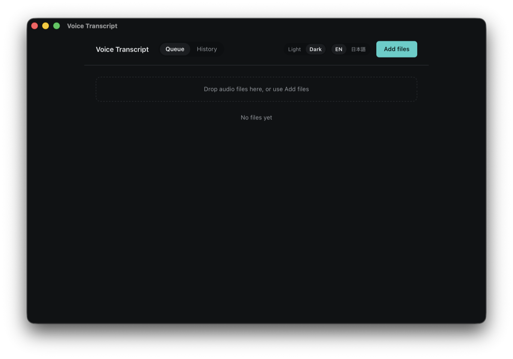
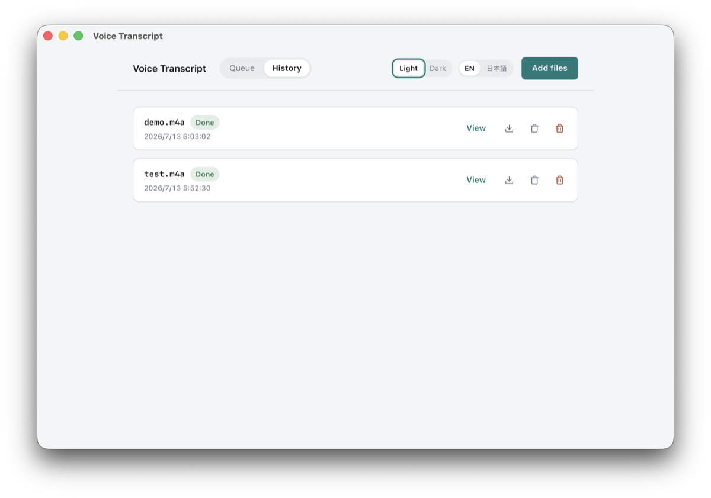
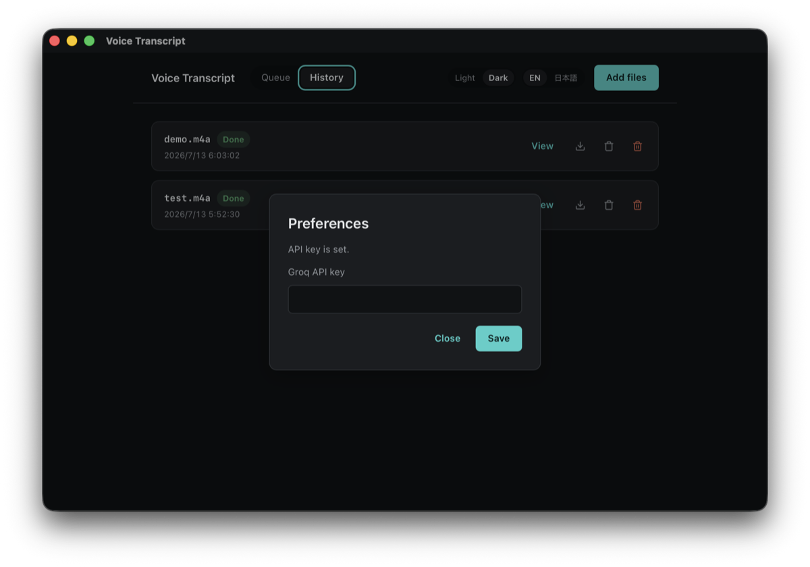
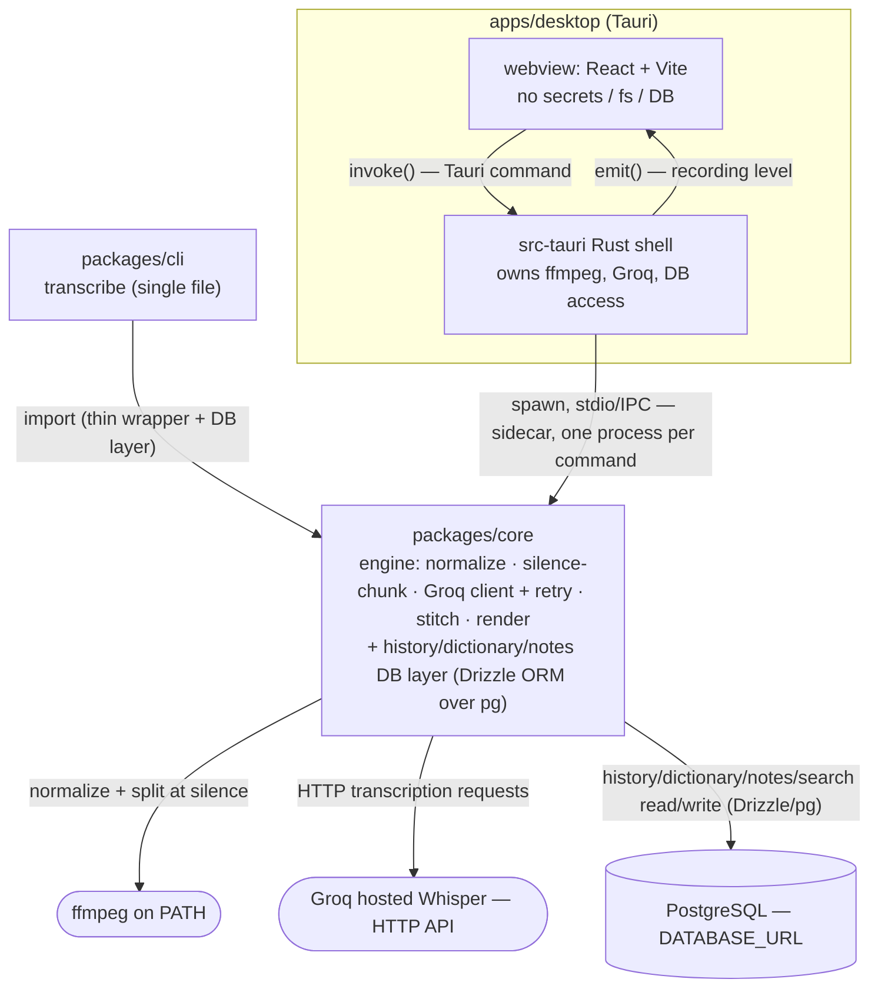

<div align="right">

[](./README.en.md)

</div>

# Voice Transcript

Groq のホスト型 Whisper API で音声を文字起こしする。ターミナル CLI とクロスプラットフォームの
デスクトップアプリの 2 つの入口から使え、無音位置での分割とスティッチで **1 時間超の長時間
音声**も確実に扱える。エンジンは共有の 1 つ、フロントは 2 つ、全実行の履歴を保存し、時間制限
なしのマイク／システム音声録音、全文字起こしに適用されるユーザー管理の単語修正辞書、任意の
文字起こしへのサイドノート注釈、全実行を横断する全文検索を備える。

## 必要環境
- **Node.js 24**
- **pnpm**（本リポジトリは workspace モノレポ: `packages/core` / `packages/cli` / `apps/desktop`）
- **ffmpeg**（`PATH` 上に必要。音声の正規化・分割に使用）
- **`GROQ_API_KEY`** — 環境変数から読み込む。デスクトップアプリでは Settings から設定
  することもできる（後述）。両方ある場合は常に環境変数が優先される。
- **PostgreSQL** — 環境変数の `DATABASE_URL` 接続文字列で到達可能なもの。文字起こし
  **履歴**・辞書・注釈・検索機能でのみ必要。文字起こし自体は DB 無しでも動く（「制約」参照）。
  DB サーバーは自分で用意し、アプリは接続するだけ。
- デスクトップアプリのビルド／実行には別途 Tauri ツールチェーン（Rust）が必要。特権操作
  （ffmpeg・Groq 呼び出し・DB アクセス）はすべて Rust シェルが担う。

## セットアップ
```sh
pnpm install                       # workspace 全パッケージを導入
```

## CLI の使い方
`transcribe` コマンドは単一ファイル専用で、デスクトップ追加後も挙動は不変。workspace の
ソースから実行する（公開・同梱はしない）:

```sh
transcribe <audio-file> [options]
```

| オプション | 説明 | 既定 |
|---|---|---|
| `-o, --output <file>` | 文字起こしをファイルに出力 | 標準出力 |
| `--format <txt\|srt\|vtt\|json>` | 出力形式 | `txt` |
| `--model <name>` | Whisper モデル（`whisper-large-v3-turbo` / `whisper-large-v3`） | `whisper-large-v3-turbo` |
| `--language <code>` | 話し言語を固定 | 自動判定 |

```sh
export GROQ_API_KEY=...                                # 必須
transcribe meeting.m4a                                 # txt を標準出力へ
transcribe meeting.m4a --format srt -o out.srt
transcribe long.m4a --model whisper-large-v3 --language ja
```

成功時は終了コード `0`。エラー時は非ゼロで stderr にメッセージ（キー未設定・ファイル不在／
不正・ffmpeg 未導入・API 失敗）。`-o` 指定時は文字起こしをファイルに書き、stderr にはログのみ
——標準出力はクリーンなまま。

## デスクトップアプリ（Windows / Linux / macOS）
```sh
pnpm --filter desktop tauri dev                        # 開発ループ
```

- **ファイルキュー:** 複数ファイルを一度に文字起こしできる（CLI は単一ファイルのままで、
  これは GUI 固有の差分）。各ファイルは独立に追跡され、1 件の失敗が他を止めない。
- **進捗:** ファイル単位、長時間ファイルの分割時はチャンク単位でも表示——不定スピナーは使わない。
- **履歴:** 全実行（CLI・GUI とも）を保存。履歴ビューで過去の実行を一覧し、開くと API を
  再呼び出しせずに保存済み文字起こしを表示する。行のステータスチップの隣にある鉛筆
  アイコンから、名前を編集可能なタイトルに変えられる——Enter またはチェックマークで保存、
  Esc でキャンセル、空にするとファイル名表示に戻る。これは元のソースファイル名には触れない
  別のタイトルであり、一度設定すると名前が表示されるすべての場所——行、書き出し時の
  提案ファイル名、確認ダイアログ、検索結果——に反映され、検索対象にもなる。
- **CLI と同じ設定**（形式・モデル・言語）を、フラグではなく Settings のコントロールとして
  提供——これがキューされる全文字起こしの実際の既定値になる。
- **マイク録音（時間制限なし）:** サイドバーの「Add files」の隣に録音ボタンを配置し、その横に
  実際に音を拾えているか確認できるライブレベルメーターを表示する。録音が完了すると
  ピックしたファイルと全く同様にキューへ加わる。音源はマイク・システム音声
  （「聞こえている音」——通話の相手側や動画など）・両方をミックスした 1 トラックから選べ、
  既定はマイクのみ（システム音声キャプチャは macOS の権限許可が必要で、Linux では
  存在しない）。キャプチャはネイティブ実装（Rust の `cpal` 経由）で webview 側では
  行わない——サンプルは届いた端から直接 WAV ファイルへストリーム書き込みされ、メモリ上に
  全体を保持することはなく、長さの上限はディスク容量のみ。レベルメーターはこの
  ネイティブ／webview 境界を越えて、1 tick ごとに導出した音量値 1 つだけを送る（生の
  音声データは送らない）。（ネイティブキャプチャは意図的な選択: リリース済みのどの Tauri
  バージョンも Linux の webview 内でのマイクキャプチャを有効化しておらず、ブラウザ API
  での録音は本アプリの 3 つの対象プラットフォームの 1 つで黙って動作しなくなるため。）
  録音の音声——アップロードしたファイルは対象外——は、文字起こしが成功すると自動的に
  ゴミ箱へ移動する（OS のゴミ箱、復元可能）。既定で有効、Settings でオフにできる。
- **カスタム辞書:** 完了した全文字起こし（CLI・GUI とも）に適用される単語→置換のペア。
  両インターフェースが同一の修正済みテキストを生成する。Settings からエントリーを管理でき
  （追加・編集時は簡単な確認表示が一瞬出る）、JSON ファイル（Amical の語彙エクスポート
  形式を含む）を冪等なアップサートとしてインポートできる。
- **文字起こし注釈（Transcript notes）:** Queue または History の展開したプレビュー内で
  テキストを選択すると、文字起こし本文自体を書き換えずにサイドコメント（聞き間違いの
  指摘など）を付けられる。保存済みの注釈はハイライト表示され、クリックで閲覧・編集・
  削除できる。保存・編集・削除はサイドカーとの往復を待たず即座に反映される。バック
  グラウンドでの保存が最終的に失敗した場合は「未保存」表示になり、再試行・破棄を選べる
  （黙って元に戻ることはない）。Cmd+Enter（Windows/Linux は Ctrl+Enter）で保存、Esc で
  キャンセル。保存済みの注釈は、引用テキストを新しいカスタム辞書エントリーへリンクでき、
  以降の文字起こしのみを修正する（その注釈が付いている文字起こし自体は変更しない）。
- **検索:** サイドバーの折りたたみトグルの隣にある検索アイコンから、タイトル・文字起こし
  本文・注釈テキストを一度に、全履歴を横断してクエリするモーダルを開ける——クライアント
  側に既に読み込まれているページのみを対象とするサイドバーの常時表示フィルターとは別物。
  スペース区切りの複数語は AND 条件だが、各語は別々のフィールドに一致してもよい。入力に
  応じて（デバウンスしつつ）結果が更新され、一致箇所はインラインでハイライトされ、矢印
  キーとEnterでテキストフィールドを離れずに操作できる。
- **表示言語:** 日本語と英語をアプリ内で切り替え可能（再起動不要）。これは音声の話し言語で
  ある `--language` とは別物。
- **テーマ:** ライト／ダークの明示トグル（OS 追従だけではない）。
- **履歴項目の削除——2 つの別アクション:** *ソース音声をゴミ箱へ* はソースファイルのみを OS
  のゴミ箱へ移し（復元可能）、履歴レコードと文字起こしは保持する。*履歴エントリを削除* は
  レコード自体を削除し、ソースファイルが残っていればそれも OS ゴミ箱へ送る。いずれも
  完全な復元不能削除ではない。
- **ネイティブ OS メニュー:** webview 内コントロールだけでなく本物の OS メニューを提供し、
  **Add files** / **Open history** / **Export**（現在の文字起こしを既存形式 txt/srt/vtt/json
  で書き出し）/ **View on GitHub** / **Preferences...** を公開。Preferences はプラット
  フォーム標準ショートカット（macOS: Cmd+, / Windows・Linux: Ctrl+,）に割り当て。

<p>
  
  
</p>
<p>
  
</p>

### Settings
サイドバーの Settings 項目、ネイティブメニューの **Preferences...**、または
Cmd+,/Ctrl+, のいずれからでも同じセクション分けされたダイアログを開く（既定は音声入力）:

- **音声入力（Voice input）** — Whisper モデル、話し言語の自動検出＋上書き、音源
  （マイク／システム音声／両方）とそのデバイス選択、録音成功後に音声を自動でゴミ箱へ
  移動するかどうか（既定でオン）。これらがキューされる全文字起こし（録音完了分を含む）
  の実際の既定値になる。
- **カスタム辞書（Custom dictionary）** — 単語置換エントリーの追加・編集・削除・
  インポート（前述）。
- **一般（General）** — 表示設定（現状は句点ごとの改行のみ）。
- **接続（Connection）** — 環境変数ではなく GUI から `GROQ_API_KEY` と `DATABASE_URL` を
  設定できる。どちらも Rust シェルが OS のユーザーごとの設定ディレクトリ内の**ローカル
  設定ファイル**（macOS: `~/Library/Application Support/…`、Windows: `%APPDATA%\…`、
  Linux: `~/.config/…`）に書き込み、リポジトリ外に置きコミットしない。webview はこれらの
  ファイルに直接触れず、値を読み返すこともできない——Connection は設定済みかどうかのみ
  表示する。サイドカーは対応する環境変数が未設定のときにのみ保存済みの値を使う。環境変数が
  両方とも設定されていれば、常に環境変数が優先される。**接続テスト**ボタンで、保存済みの
  データベース URL に今すぐ実際に接続できるかを確認でき、失敗時は本当のエラー内容
  （タイムアウトや認証失敗など）を表示する——入力欄に何か打つ必要はなく、保存済みの値を
  テストする。

トレードオフ（明言）: API キー・データベース URL は暗号化された OS キーチェーンではなく、
平文のオンディスク保存である。守りは所有者のみのファイル権限とリポジトリ外配置だけ。
単一ユーザーの個人ツールとして許容範囲だが、複数ユーザーや共有マシンでの利用前には
見直し（例: OS キーチェーンへの移行）が必要。

## 出力と長時間音声の挙動
- 形式: `txt`（既定・タイムスタンプ無し）／`srt`／`vtt`／`json`（区間・語のタイムスタンプ）。
- 長時間音声: ffmpeg で 16 kHz モノラルに正規化 → エンコード後が閾値（約 24 MB、Groq の
  25 MB/リクエスト上限の下）を超える場合は**無音位置で分割** → 各チャンクを文字起こし →
  各チャンクの時間オフセットを適用して**スティッチ**（マージ後のタイムスタンプは単調
  非減少）。約 78 分の `tests/test.m4a`（73 MB）で検証。この正規化・分割で生成される
  一時ファイルは、実行が成功しても失敗しても終了時にすべて削除される。
- 同じファイルを同じ設定で CLI と GUI で処理するとバイト単位で同一のテキストになる——
  どちらも同じ `packages/core` エンジンを呼ぶため。

## 文字起こし履歴（Postgres）
完了した全実行（CLI・GUI とも）が 1 レコードを書き込む: ソースファイル名、開始時刻、モデル、
言語、要求形式、ステータス、文字起こしテキスト（形式に応じて区間も）。`DATABASE_URL` は
環境変数から読み、未設定なら GUI の Settings の値にフォールバックする（前述）。DB 関連は
ハードコードしない。データアクセス層は ORM／クエリビルダー経由（マイグレーション以外に
ベンダー固有の生 SQL を置かない）とし、将来の MySQL や別ホストへの移行を書き換えではなく
設定変更で済むようにする。アプリは Postgres に接続すると、テーブルが無ければ自動的に
作成する（冪等な追跡付きマイグレーション、毎回実行しても安全）——ただしデータベース自体の
構築はせず、バックアップもしない。バックグラウンドでの履歴更新が失敗した場合、直前まで
表示していた一覧はそのまま残り、そこに本当のエラー内容（定型文だけでなく）も併記される。

## カスタム辞書（単語置換）
文字起こし後、結果がレンダリング・履歴記録・返却される前に適用される——CLI と GUI の両方の
経路で同一。マッチングは大文字小文字を区別する文字列一致: ASCII 文字のみからなる単語は
単語単位でのみ一致し（より大きなトークン内では発火しない）、非 ASCII 文字を含む単語
（日本語のエントリーすべて）は単純な部分文字列として一致する（日本語には空白による単語
境界が存在しないため）。置換は単語が長い順に並べた 1 回のパスとして行う——これにより、
短い単語を含む長いエントリーが優先され、辞書が増えてもカスケードしない結果が保たれる。
エントリーは履歴と同じ Postgres データベース（`word` にユニーク制約を持つ
`dictionary_entries` テーブル）に保存される。そのため履歴と同様、`DATABASE_URL` が
未設定／到達不能な場合は辞書も利用できない——これによって文字起こし自体が止まったり
失敗したりすることはなく、単に置換が適用されないだけである。

インポートは本アプリ独自の `{ word, replacement }[]` 形式に加え、Amical の語彙エクスポート
形式（`{ entries: [{ word, replacement_word, is_replacement, ... }] }`——`is_replacement`
が偽のエントリーはスキップ）にも直接対応する。同じファイルの再インポートは冪等: 行数も
置換内容も変化しない。

## 文字起こし注釈（Transcript notes）
文字起こし本文は書き換えず、特定の単語やフレーズにサイドコメントを付ける機能——例えば
聞き間違いを指摘する。「その場で修正する」ではなく「コメントを残す」を意図的に選択した。
保存済み履歴エントリーを持つどの行からでも、Queue・History どちらからも使える: 行の
展開されたプレビュー内でテキストを選択すると小さなポップオーバーが開き、注釈を付けられる。
保存済みの注釈はハイライトされたスパンとして表示され、クリックで閲覧・編集・削除できる。
アンカリングは保存済み文字起こしテキストへの生の文字オフセット範囲であり、タイムスタンプ
ではないため、無期限に有効なまま残る。重なる範囲の注釈は拒否される。

追加・編集・削除は表示中の文字起こしに即座に反映されポップオーバーも即座に閉じる——サイド
カーとの往復を待たない。バックグラウンドでの書き込みが最終的に失敗した場合、注釈は
「未保存」の見た目で表示され、黙って元に戻る代わりに再試行・破棄を選べる。Cmd+Enter
（Windows/Linux は Ctrl+Enter）で保存、Esc はそのときポップオーバーに表示されている
Cancel と同じ動作をする。保存済みの注釈は、引用テキストを新しいカスタム辞書エントリーへ
リンクでき、以降の文字起こしのみを修正する——文字起こし本文が編集されないという原則通り、
その注釈が付いている文字起こし自体は変更しない。注釈は独自のテーブルに保存され、
`ON DELETE CASCADE` で履歴エントリーに外部キー結合されているため、対象の文字起こしより
長く残ることはない。

## 検索
サイドバーの折りたたみトグルの隣にある検索アイコン（サイドバーを折りたたんでいても押せる）
から、タイトル・文字起こし本文・注釈テキストを一度に、全履歴を横断してクエリするモーダルを
開ける——クライアント側に既に読み込まれているページのみを対象とする、サイドバー自体の
常時表示インラインフィルターとは別物。ここでの「タイトル」はその項目に現在表示されている
名前を指す——History のリネーム機能でカスタムタイトルを設定していれば、置き換えられた
ファイル名ではなくそのタイトルが検索対象になる。クエリ内のスペース区切りの語は AND 条件で
結合されるが、各語はタイトル・本文・注釈のうち別々のフィールドに一致してもよい。注釈にしか一致しない
場合でも結果に表示され、理由が分かるようにその注釈自体のテキストを示す（一致理由の
分からない裸のファイル名だけにはしない）。入力に応じて結果が更新され（検索ごとに
バックエンドへの往復が発生するため約 250ms デバウンス）、一致した語はインラインで
ハイライトされ、矢印キーでフォーカス中の結果を移動しEnterで開ける。Esc またはモーダル
背景のクリックで閉じ、Cmd+F/Ctrl+F でアプリ内のどこからでも開ける。

## リリース自動化
手動トリガーの GitHub Actions ワークフロー（`.github/workflows/release.yml`、
`workflow_dispatch` のみ——push/tag では発火しない）。入力は **title** と **version/tag** の
2 つだけ。`windows-latest` / `ubuntu-latest` / `macos-latest` で **`apps/desktop` のみ**を
ビルドし、各プラットフォームのネイティブインストーラ（macOS `.dmg`、Windows `.exe`、Linux
`.AppImage`/`.deb`）を GitHub Release にアップロードする。`packages/cli` はリリースでは
ビルド・公開されず、ソースから使う。

### macOS:「壊れているため開けません」と表示される場合
このリリースビルドは Apple Developer ID によるコード署名も公証(notarization)もされて
いない（有料の Apple Developer Program 登録が必要で、本プロジェクトのスコープ外）。ブラウザ
経由でダウンロードすると `com.apple.quarantine` フラグが付き、Gatekeeper がアドホック署名を
拒否してこの紛らわしいメッセージを表示する——アプリ自体が壊れているわけではない。
`/Applications` に移動した後、以下で解消する:
```sh
xattr -cr "/Applications/Voice Transcript.app"
```
Windows・Linux ではこの問題は起きない——Windows は「発行元不明」の SmartScreen 警告が出る
場合があるが「実行」で続行でき、Linux の `.AppImage`/`.deb` はそもそも署名を要求しない。

## 制約
- **Groq 無料枠のみ:** 25 MB/リクエスト、7,200 音声秒/時、2,000 リクエスト/日。分割戦略は
  25 MB 上限を守るために存在する。
- ソース・CLI 出力・GUI コピーに**絵文字禁止**。GUI の**色は必ず design token 経由**
  （hex ハードコード禁止、design gate で強制）。
- 履歴（および同じデータベースを共有する辞書・注釈・検索）には到達可能な Postgres が
  必要だが、DB が未設定／到達不能でも文字起こしは完了すること——失敗するのは履歴書き込み
  のみで、それは明示的にログされ（黙って失敗しない）、文字起こし自体を止めたり壊したり
  しない。
- 録音にソフトウェアによる時間上限はないが、標準的な WAV ファイルの RIFF サイズフィールド
  自体が典型的なキャプチャレートで約 3〜4 時間という物理的な上限を持つ——これは上記の
  Groq 自身の 1 時間あたりの音声予算をはるかに超えているため、実用上のセッション長の
  制約にはならない。
- git はローカルのみ。指示がない限り push しない。生成物の言語は英語。

## 対象外（明示）
話者分離、翻訳、要約／LLM による後処理、CLI の一括・ディレクトリ・複数ファイル処理（GUI の
キューは GUI 限定）、リアルタイム／ストリーミング、リモート URL 入力（ローカルファイルのみ）、
複数ユーザーアカウント／認証（ローカル 1 ユーザーの履歴のみ、ログイン無し）、DB の構築／
ホスティング／バックアップ自動化、同一 DB を指す以上のデバイス間同期（last-write-wins、
競合解決なし）。詳細は `SPEC.md`。

## アーキテクチャ
共有の `packages/core` エンジン（ffmpeg 正規化・無音ベースの分割・Groq クライアント＋
リトライ・スティッチ・各形式レンダラ——UI も DB も持たない）を、2 つのフロントが囲む。
`packages/cli` はこれを直接ラップする。`apps/desktop` は Rust シェル経由でのみ到達し、その
シェルが全特権操作（ffmpeg・Groq 呼び出し・DB アクセス）を担い、`packages/core`（エンジンと
DB 層）を stdio/IPC 上の監督付き Node **サイドカー**として動かす——Rust 自身は SQL を実行せず、
GUI 経由で ffmpeg・Groq・DB に実際に到達するのはこのサイドカーだけ。webview はシークレット・
ファイルシステム・DB に直接触れない。サイドカーの各コマンドは毎回新しく短命なプロセスであり、
Rust は応答が返るだけでなくプロセスが実際に終了するまで待つ——そのためプロセス自身の DB
接続は、居座り続けるのではなく本当にアイドルになった瞬間に終了できるよう設定されている。


```mermaid
flowchart TD
    cli["packages/cli<br/>transcribe (single file)"]
    subgraph desktop["apps/desktop (Tauri)"]
        webview["webview: React + Vite<br/>no secrets / fs / DB"]
        rust["src-tauri Rust shell<br/>owns ffmpeg, Groq, DB access"]
        webview -->|"invoke() — Tauri command"| rust
        rust -->|"emit() — recording level"| webview
    end
    core["packages/core<br/>engine: normalize · silence-chunk · Groq client + retry · stitch · render<br/>+ history/dictionary/notes DB layer (Drizzle ORM over pg)"]
    ffmpeg(["ffmpeg on PATH"])
    groq(["Groq hosted Whisper — HTTP API"])
    db[("PostgreSQL — DATABASE_URL")]

    cli -->|"import (thin wrapper + DB layer)"| core
    rust -->|"spawn, stdio/IPC — sidecar, one process per command"| core
    core -->|"normalize + split at silence"| ffmpeg
    core -->|"HTTP transcription requests"| groq
    core -->|"history/dictionary/notes/search read/write (Drizzle/pg)"| db
```

## 開発（ゲート付きパイプライン）
このリポジトリは `scripts/run.sh` のゲート付きパイプラインで作られる（仕様確定 → 失敗する
テスト → design gate → 計画 → 機能ごとの build → 受け入れ）。任意の段階から再開できる:
```sh
sh scripts/run.sh from build                 # この段階から最後まで実行
INTERACTIVE=1 sh scripts/run.sh from build   # 可視 TUI / 通知付きで進捗を見ながら
```
合否基準は `ACCEPTANCE.md`、段階定義は `pipeline.yaml`。この README 2 ファイルは `SPEC.md`
から（`sh scripts/run.sh readme` で）生成され、手書きではない。
